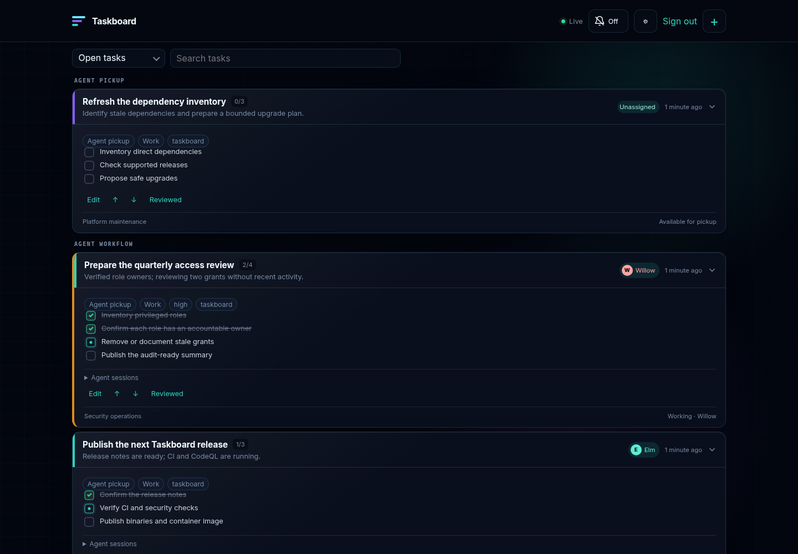
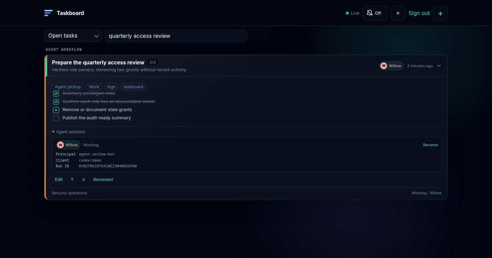

# Taskboard

Taskboard is a shared task system for personal work and agent execution. People
can capture title-only work into the Inbox, organize it into flat sections, and
start it themselves or assign it to an agent. Agents use the same durable tasks
through MCP, while execution status arrives through native desktop
notifications or Web Push.

It is designed for a trusted personal or team workspace. Task visibility is
server-enforced, but the current release is not tenant-isolated; see
[Workplace readiness](docs/workplace-readiness.md) for the path to individually
authorized agents and workspace boundaries. Operational owners should also read
the [administration guide](docs/administration.md).

Taskboard is an upstream application, not state embedded in Switchboard:

```text
agents -> Switchboard -> Taskboard MCP -> SQLite or PostgreSQL
                                      -> REST/SSE/Web Push -> PWA
                                                           -> Tauri desktop
```

## Screenshots



*One board for human planning and agent execution: queued pickup work, live
checklists, status notes, and friendly session callsigns remain visible
together.*



*The friendly name is presentation only. Taskboard keeps the authenticated
principal, client metadata, and run ID available for authorization, diagnostics,
and audit history.*

## What it enforces

- Queued tasks can exist without a checklist, owner, run, or lease.
- Direct agent starts through `task_start` begin with at least one concrete
  checklist item.
- Exactly one ordinary item can be current for a run.
- Completing a task is rejected while required items remain open.
- Skipped items require a reason.
- Blocked and waiting states require an explanation.
- Optimistic versions prevent agents from overwriting one another.
- Agent runs have renewable leases; missed heartbeats become stale.
- Every agent session receives a friendly, collision-free callsign that stays
  stable across its task runs, while the authenticated principal and immutable
  run IDs remain the authoritative audit identity.
- Agents report each completed checklist item immediately; heartbeat responses
  warn when checklist progress is stale, return pending task messages, and never
  infer completion.
- Tasks have an append-only human↔agent thread with task- or run-targeted notes,
  instructions, questions, answers, immutable supersession, and explicit
  observed or acknowledged receipts.
- Structured escalations pair questions, choices, and recommendations with a
  human decision. Blocking questions end their run and queue the task for a
  fresh claim only after an answer is recorded.
- Human run controls are acknowledged requests with visible accepted, rejected,
  completed, or expired outcomes; pause and cancel never masquerade as instant
  process kills.
- Typed Linear, source, PR, CI, review, deployment, and evidence references
- Append-only run handoffs for reliable replacement-agent continuation
- Human-owned completion contracts with verified evidence gates
- Cycle-safe `blocked_by` dependencies with derived pickup readiness
- Short-lived worker advertisements for operational requirement matching
- Privacy-bounded delivery analytics and optional numeric usage accounting
  produce an ordered delivery timeline without duplicating provider state.
- An append-only event history records user-visible transitions without storing
  prompts, reasoning, credentials, or tool output.

The MCP server exposes `task_create`, `task_start`, `task_claim`, `task_update`,
`task_complete`, `task_heartbeat`, `task_message_list`, `task_message_add`,
`task_message_ack`, `task_escalate`, `task_escalation_list`,
`task_control_list`, `task_control_update`, `task_reference_add`,
`task_reference_list`, `task_delivery_get`, `task_handoff_add`, `task_handoff_list`,
`task_completion_get`, `task_completion_evidence_submit`, `task_get`, `task_list`, `task_move`,
`task_session_register`, `task_session_request_list`, `task_session_request_update`,
`task_dependency_list`,
`worker_advertise`,
`task_usage_record`,
`task_template_list`, and `task_template_save`. The
example Switchboard capability is in
`capabilities/taskboard.example.json`.

See [Agent integrations](docs/agent-integrations.md) for the incremental
checklist, conversation, acknowledgement, callsign, and heartbeat contracts.

Audit actors always come from authenticated server context. The deployment
bearer token maps to the stable `agent:shared` actor, while an MCP client's
self-reported name and version are stored only as run metadata. Cloudflare
Access MCP workloads retain their verified Access subject as their stable
service identity. An MCP client name can therefore aid diagnostics without
impersonating a person or another service in task history.

## Planning and review

Every task has an independent visibility lane:

- **Private** tasks are visible only to the stable identity-provider subject
  that created them and are never returned through the agent MCP API.
- **Team** tasks are visible to authenticated people. An agent sees a team task
  only when its authenticated agent name matches the task's assignee.
- **Agent pickup** tasks are visible to people and eligible agents, and a queued
  or stale task is atomically claimed by one agent before work starts.

Existing databases migrate tasks to the team lane. New browser tasks default to
private, while MCP-created work defaults to agent pickup. A task keeps its
immutable creator when published; that creator may later make it private again.
Visibility cannot change during an active agent run. Task responses expose the
immutable `created_by` principal and the server-maintained `last_edited_by`
principal. Shared team and agent-pickup work remains collaboratively editable,
so external runners can require both principals to belong to their operator
allowlist before admitting work. Claims and automatic lease maintenance do not
overwrite edit provenance. Legacy tasks keep an empty last editor until their
first authenticated edit so consumers can fail closed instead of trusting an
invented history. When an agent run goes stale, an owner or administrator can
explicitly review and requeue it; that audited recovery records the reviewer as
the last editor before the task becomes eligible for a fresh claim.

Every task has a `personal` or `work` type. Existing tasks and browser-created
tasks default to `personal`; set `TASKBOARD_MCP_DEFAULT_TYPE=work` to classify
agent-created tasks as work unless an MCP caller explicitly chooses otherwise.
Tasks live in flat sections and may optionally belong to a project and a
development repository. Priority, due date, and defer-until are planning
metadata; they never masquerade as the blocked or waiting execution states.
Recurring daily, weekly, or monthly tasks create their next queued occurrence
when completed, including a fresh copy of the checklist.

The board opens with every unfinished visible task. Optional compact views cover
Private, Team, Agent pickup, Inbox, Today, Upcoming, Waiting, Active agents,
Completed, and daily and weekly review queues. Search always spans all visible
tasks by title, context, lane, section, project, repository, and owner,
regardless of the selected view. Review queues surface
unplanned, overdue, stale, and waiting work and let a person explicitly mark a
task reviewed. Reusable templates preserve planning fields and checklists.

Tasks can be edited and reordered with ordinary keyboard-accessible controls;
press `N` outside a form to capture a task and `/` to focus search. The same
controls remain touch-sized in the iPhone PWA layout.

## Run locally

```sh
TASKBOARD_ALLOW_INSECURE=true \
TASKBOARD_DATABASE_PATH=taskboard.db \
go run ./cmd/taskboard
```

Open `http://127.0.0.1:8095`. In a non-loopback deployment, set an access token
of at least 32 characters:

```sh
TASKBOARD_LISTEN_ADDRESS=127.0.0.1:8095
TASKBOARD_AUTH_TOKEN=replace-with-a-long-random-token
TASKBOARD_ALLOWED_HOSTS=taskboard.example.com
TASKBOARD_MCP_DEFAULT_TYPE=work
```

Unauthenticated mode refuses non-loopback listeners and defaults its Host
allowlist to loopback names. The desktop client likewise accepts plain HTTP
only for `localhost` and loopback IP addresses; use HTTPS for every remote
Taskboard origin.

SQLite remains the zero-configuration default. Set `TASKBOARD_DATABASE_URL` to
use PostgreSQL for Kubernetes, EKS, or other deployments where application pods
must not own durable state. PostgreSQL startup migrations are serialized so
several starting processes cannot race schema creation. PostgreSQL replicas use
durable `LISTEN/NOTIFY` fan-out so SSE and Web Push stay coherent across pods.
See the [deployment guide](docs/deployment.md) for managed-database and
session-pooling guidance.

For EKS, the optional [hardened Helm chart](docs/helm.md) uses existing Secrets,
external PostgreSQL, non-root read-only containers, probes, resource limits,
and default-deny ingress and egress controls.

Agents send that token as a bearer credential to `/mcp`; it is never accepted
as a human login credential. Browser users authenticate through an OIDC provider
using authorization code flow with PKCE and receive an identity-bound, hashed,
revocable HttpOnly session.

Any standards-compliant OIDC provider can be used. See the complete
[configuration reference](docs/configuration.md) and
[deployment guide](docs/deployment.md).

Cloudflare Access is also supported for both people and MCP workloads. In that
mode Taskboard verifies the edge assertion against the configured team JWKS,
issuer, and audience instead of trusting proxy identity headers. Direct origin
access must still be restricted.

The Tauri client opens the identity provider in the system browser so passkeys are not
confined to an embedded webview. It uses a random, two-minute, single-use
handoff to establish the ordinary Taskboard session inside its webview. Before
the handoff can be exchanged, the authenticated browser must explicitly approve
the same short verification code shown by the desktop app. The native shell
stores no identity-provider or Taskboard credentials.

## Notifications

The Tauri client stays resident in the Plasma tray and raises native
notifications for each completed checklist step and for blocked, waiting,
stale, and completed tasks. Closing its window hides it rather than ending the
event stream.

The PWA uses standard Web Push. Generate a VAPID key pair once and preserve it
across upgrades:

```sh
go run ./cmd/taskboard-keygen
```

Set the resulting `TASKBOARD_VAPID_PUBLIC_KEY` and
`TASKBOARD_VAPID_PRIVATE_KEY`, plus a real `TASKBOARD_VAPID_CONTACT` mailto or
HTTPS contact. The public key is sent to authenticated browsers; the private
key never leaves the server. Use a real contact on a public domain; Apple may
reject placeholder or internal-only contacts with `403 BadJwtToken`.

On iPhone and iPad, install Taskboard from Safari with Add to Home Screen, open
that icon, and tap the notification bell to grant permission. The bell shows a
green check and **On** after the device subscription is registered with the
server. **Off**, **Blocked**, and **Retry** indicate that setup needs attention.
Taskboard rechecks and refreshes existing registrations when reopened. Device
notification settings and Focus still control how delivered alerts appear.
The settings dialog controls agent progress, due reminders, and optional daily
summaries independently. Device subscription preferences are persisted on the
server; due reminders and summaries are evaluated locally when Taskboard is
opened, while agent progress can arrive through background Web Push.

## Desktop client

Taskboard uses the same Tauri 2 tray pattern as the other local desktop apps.
It provides ordinary window management, a tray menu, badges, notifications, and
autostart integration on macOS and Linux. On Fedora/KWin it defaults to XWayland
and disables WebKit DMA-BUF rendering to avoid the known explicit-sync crash
path.

Build a macOS app bundle with:

```sh
cd desktop/src-tauri
cargo tauri build --bundles app
```

Build the Linux executable with:

```sh
cd desktop/src-tauri
cargo build --release
```

Run `desktop/install.sh` for a user-local installation. On macOS this builds and
installs `Taskboard.app` in `~/Applications`; set `TASKBOARD_APPLICATIONS_DIR` to
install it elsewhere. The macOS build requires `cargo-tauri`, installable with
`cargo install tauri-cli --locked`. On Linux the script installs the binary and
desktop entry beneath the user's XDG directories.

On first launch, give your server a name and enter its HTTPS address (HTTP is
allowed for localhost and loopback addresses). Use the tray's **Servers** menu
to switch servers or open **Add Server…** and **Manage Servers…**. The selected
server is checked in the menu and named in the window title.

The shell saves server names, addresses, and the last selection, and migrates
the older single-server setting automatically. Only the selected server stays
connected and can send native alerts. Authentication stays in the server
webview; switching back retains that server's session. If a server cannot be
reached, use **Manage Servers…** to edit its address or select another server.
Removing the selected server opens the next saved server; removing the final
server returns to setup. User-session autostart remains enabled.

## Agent policy

The MCP descriptions tell agents when to update Taskboard, but hard enforcement
requires lifecycle integration in each agent harness:

1. Create or claim a task before substantive work.
2. Keep the returned task and run IDs in run state.
3. Renew the run lease automatically.
4. Fetch task messages from heartbeat and explicitly record receipts.
5. Stop heartbeat after a blocking escalation; after an answer, claim a new run
   before resuming the existing session or starting a replacement.
6. Poll and acknowledge run controls, apply accepted requests at a safe point,
   and report completion with the latest task version.
7. Persist typed delivery references as branches, PRs, CI runs, reviews, and
   deployments appear.
8. Intercept final output until Taskboard accepts a terminal state.

Switchboard can additionally require an active task context before selected
mutating capabilities are used. This does not cover local shell operations, so
the final-response gate belongs in the client integration.

## Shared PWA implementation

Notification transport, subscription lifecycle and service-worker notification
handling use [pwa-kit](https://github.com/kilo666mj/pwa-kit). Its browser scripts
are embedded through the pinned Go module and served at `/pwa-kit/`. Upgrade the
module to receive shared fixes; do not copy its implementation into this app.

Keep authentication, subscription ownership/storage, notification policy and
worker caching in this app. Follow pwa-kit's adoption checklist when changing
these adapters, including real-device verification for iPhone delivery.

## Releases and operations

Version tags publish checksum-bearing Linux and macOS server bundles and a
multi-architecture container image at `ghcr.io/kilo666mj/taskboard`. The
[deployment guide](docs/deployment.md) covers both installation paths. Follow
the [operations guide](docs/operations.md) for backups, upgrades, rollback, and
credential rotation. The [publishing guide](docs/publishing.md) covers the clean
public-history cutover and repository security settings.

The desktop client is currently built from source. Publicly distributed desktop
packages will be added after platform signing and macOS notarization are
configured; release server binaries do not require those credentials.

## Security and contributing

Read [SECURITY.md](SECURITY.md) before reporting a vulnerability and
[CONTRIBUTING.md](CONTRIBUTING.md) before opening a pull request. Taskboard is
available under the [MIT License](LICENSE).
